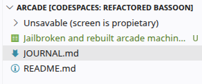
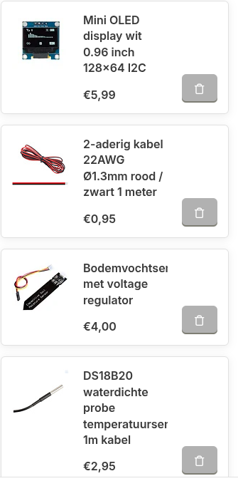
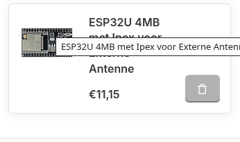

# 3/6/2026 2 PM - Documenting the docs

_Time spent: 0.5h_

Documented all of the READMES, BOMs and the full gh page.

Its really not that deep, so I gotto scramble 50 words for now :smiley:

So yea, thats it......

also need a soldering iron

# 3/6/2026 2 PM - Measureing and drawing

_Time spent: 2.5h_

This part of today I measured some voltages and accidentally ripped off the connector for the VDD:

But well, that what you get when you fuck with the crappiest PCB I have ever seen.

I also worked on making the electrical schema, and went back to the drawing board, so its just the ESP and some labels to make it more clean:

(Also did some of the design work in the train, why is NS wifi so bad?

# 3/6/2026 2 PM - electrical schema

_Time spent: 1.25h_

Worked on the electrical schema, could not find a sym for the screen, so i use 24 pin conn. Spent like 0.9 hours srearching and 0.3 hours designing during my german lesson

Also tought about using a bettery ipv normal power

# 3/6/2026 2 PM - Multimeasuring

_Time spent: 2.5h_

Today I searched for the correct voltages. It took way too long bc I had to convince my shop teacher to let me use the soldering iron, and had to solder the 4.5V input to a 9V battery

Also worked on the materials i will need for this project, for now:

Soldering Iron
Soldering tin
Lötpaste (or the stuff you put on a pcb before soldering)
Soldering wires
ESP 32S3
The arcade machine

# 3/6/2026 2 PM - Project specs

_Time spent: 1.75h_

Today I worked on finding good specs, bc the screen is a bit of a pain in the a**.

I put my sights on this seeed esp from the kiwishop.

image

Its probably the only thing i need to buy

# 3/6/2026 2 PM - The start of all

_Time spent: 1h_

Worked on ID'ing the components, and seeing what is usable and what is not. The next steps will we to remove all the not usables, and starting make make some microcontrollers work

Also spent like 0,5 hours trying to open the case with a dremel

This looks big, is small

# 4/28/2026 2 PM - Research, mailing and a bit of fire

_Time spent: 1h_

Sooo, I have pretty good news, after researching with friends. And luckily getting my hand on an extra screen, testing with a psu and even an oscilloscope I was able to find out that Action uses its own set of commands, connectors etc. That means I will soon be anding this screen to the bom:

I also accidentally burned the other screen...

# 5/12/2026 11 AM - Designing logic, finding scems,

_Time spent: 1h_

For now I have worked on creating the things for the screen. also started on the powering of lamps etc.

I will also add a clock for now, and I am still thinking of functionalitys

# May 15th: migrating files and eda

Today I tried to migrate some of the files from stasis, because I will need more time than stasis has, and this is more "dedicated" (maybe??) ysws. Also fixed a bug in simulattion there the screen kept burning trough. Also cleaned up the repo. 

**Total time spent: 1 hours**

<!--
  This journal is auto generated by Stasis. So its exported, but I did not submit it. :)
-->

# May 18th: Getting ready for crop season (next year? alr planted the harvest of this year)

I have done some reasearch on pH soil analyzers, in the hope to find a cheap one. Or just a full and cheap soil analyzer, but they where all pretty expensive. I added a temp and moisture sensor, so I can at least not overwater my carrots.
 **Total time spent: 0.75 hour**
 

 # May 20th: Worked of finding an alternative esp that supports LoRa, and

 Also worked on finding the esp for in the garden. Doring the time I also found out that I had the wrong Kicad sym, and chaged that. Also Actually worked on storing the items in a cart in otronic :).

 
 

**Total time spent: 1 hour**
